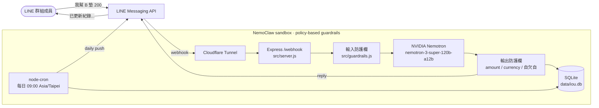

# iou-agent

> **IOU Agent 幫人類做想做但不敢做的事 — 定時提醒朋友還錢。**
> *IOU Agent does what you wish you could but don't dare to — nag your friends about the money they owe you.*

> 你不催，當凱子。你催了，又怕傷感情。
> 這種尷尬本來只能你自己扛，直到 IOU agent 來了。
>
> *Don't nag → you eat the loss. Do nag → you risk the friendship. iou-agent takes the awkward part off your hands.*

NVIDIA Agent Hackathon 2026 參賽作品。LINE 群組記帳 bot，用 **Nemotron** 讀懂自然語言、**NemoClaw** 做沙箱防護。

---

## 架構 / Architecture



---

## 怎麼用 / How it works

1. 把 bot 加進 LINE 群組
2. 群裡有人說「我幫 Bob 墊了 200」、「Carol 欠我 30 美元飲料錢」
3. Nemotron 抽出欠條 → 寫進 SQLite → bot 回 `已更新紀錄，目前欠條...`
4. 每天 09:00 (Asia/Taipei) 自動推當日結算

---

## 三個帳號要先準備好 / Three things to set up

| 要準備什麼 | 去哪申請 | 詳細步驟 |
|---|---|---|
| **LINE Messaging API channel**（免費） | https://developers.line.biz/console/ | [`docs/setup-line.md`](docs/setup-line.md) |
| **NVIDIA Build API key**（免費 ~1000 credits） | https://build.nvidia.com/ | [`docs/setup-nvidia.md`](docs/setup-nvidia.md) |
| **Cloudflare Tunnel**（給 LINE webhook 用的 HTTPS URL） | 一行 `cloudflared tunnel --url http://localhost:3000` | [`docs/setup-tunnel.md`](docs/setup-tunnel.md) |

把這三組值填進 `.env`（複製 `.env.example`），就可以 `npm start`。

---

## 原則導向防護欄 / Policy-based guardrails

iou-agent 用 **NVIDIA NemoClaw** 把推論跑在沙箱裡，做 **defense-in-depth** 兩層防護：

- **應用層**（`src/guardrails.js`）— 輸入端擋 prompt injection、輸出端擋金額溢位／非法幣別／自欠自。
- **平台層**（NemoClaw policy）— 沙箱只允許 `POST integrate.api.nvidia.com/v1/chat/completions` 和 `POST api.line.me/v2/bot/message/*`，其他全 deny。

設定 NemoClaw：

**前置條件 / Prerequisites**

NemoClaw 沙箱在 Docker 容器裡跑，所以執行安裝腳本前，請先確認：

1. **Docker Desktop 已開啟**（Windows / macOS 使用者）— 從工作列／選單列開啟 Docker Desktop，等到鯨魚 icon 變綠（穩定狀態）。
2. **WSL2 使用者**：Docker Desktop → Settings → Resources → **WSL Integration**，把你的 distro 打開。
3. **Linux 原生使用者**：用 `docker-ce`，並確認 `docker ps` 不會跳權限錯誤（必要時把使用者加進 `docker` group）。
4. **`NVIDIA_API_KEY`** 已寫進 `.env`（從 https://build.nvidia.com/ 申請）。

驗證環境準備好了：

```bash
docker ps          # 應該要列出容器列表（即使是空的），不能報 daemon 連不到
echo $NVIDIA_API_KEY  # 應該有值，或 .env 裡有這行
```

**安裝 / Install**

```bash
./scripts/install_nemoclaw.sh
nemoclaw policy apply --preset ./nemoclaw/iou-agent-policy.yaml --sandbox iou-agent
nemoclaw policy apply --preset ./nemoclaw/presets/line-bot.yaml --sandbox iou-agent
```

常見錯誤：

| 錯誤訊息 | 原因 / 解法 |
|---|---|
| `ERROR: docker daemon not reachable` | Docker Desktop 沒開，或 WSL Integration 沒打開。回到上面前置條件第 1、2 步。 |
| `ERROR: docker not on PATH` | 同上，Docker Desktop 沒裝或 WSL Integration 沒打開。 |
| `ERROR: NVIDIA_API_KEY is not set` | `.env` 裡沒這行，或直接用 `NVIDIA_API_KEY=xxx ./scripts/install_nemoclaw.sh` 傳進來。 |
| `nemoclaw onboard` 卡在 step 2/8（WSL2） | Docker Desktop 對 `--network host` 的相容性問題，見 [`docs/nemoclaw.md`](docs/nemoclaw.md#status-on-the-submission-hardware) 的三個 fix paths。 |

兩個 YAML 都在 [`nemoclaw/`](nemoclaw/) 裡，更多細節（防護欄分層、攻擊面分析、WSL2 已知問題）見 [`docs/nemoclaw.md`](docs/nemoclaw.md)。

---

## 不接 LINE 也能 demo / Demo without LINE

```bash
npm install
cp .env.example .env       # 填 NVIDIA_API_KEY 就好
npm run test:extract       # 跑 4 句範例，看 Nemotron 抽出來的 JSON
npm run demo:seed          # 灌假資料 + 印餘額
```

---

## 為什麼要自架 / Why self-host

這是 self-hosted 開源軟體，不會提供共用 bot。原因（隱私、責任、費用、rate limit）見 [`docs/why-self-host.md`](docs/why-self-host.md)。

## License

Apache 2.0
